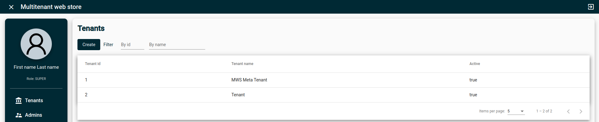

# Multitenant web store

This project is my Master's Thesis at Universidad de Granada (Doble Grado en Ingeniería Informática y Matemáticas).
There is a study of multi-tenancy in Cloud computing, its implications and trade-offs.
Multi-tenancy is a property of a system where multiple customers, so-called tenants, transparently share the system’s resources.

A minimalist multi-tenant web store called MW-Store is implemented to study the characteristics of this type of system.
The super user of this store can create tenants (in this case, organizations with e-commerce) from its admin console:

It is relevant to highlight that each tenant data is logically separated (although all tenants data share a database).
A business can not access to the administrative information of other businesses.
The super user manages the admins of each tenant:

At this point, the registered business will control its online e-commerce.
Business admins can create/update/delete products from their back office:

Then, the end users of each e-commerce can order the products:

And an order history is stored. Each client will have access to its own orders, but tenant administratos are able to query all the order history:

A Colored Petri Net (CPN), a mathematical model of the system, is included to extract conclusions about their properties.
It is possible to detect the effective conflicts of a system and adapt the design for better scalability (or even better, elasticity).
Modeling reactive systems with CPNs have several advantages explained in the dissertation.
Here is the final CPN model of the MW-Store shown with CPN Tools interface:

The implications of mathematical models of programs are huge.
These models are not limited to demonstrate static and dynamic system properties.
They can be used as an starting point for software observability, helping to solve real-world bugs in complex software.